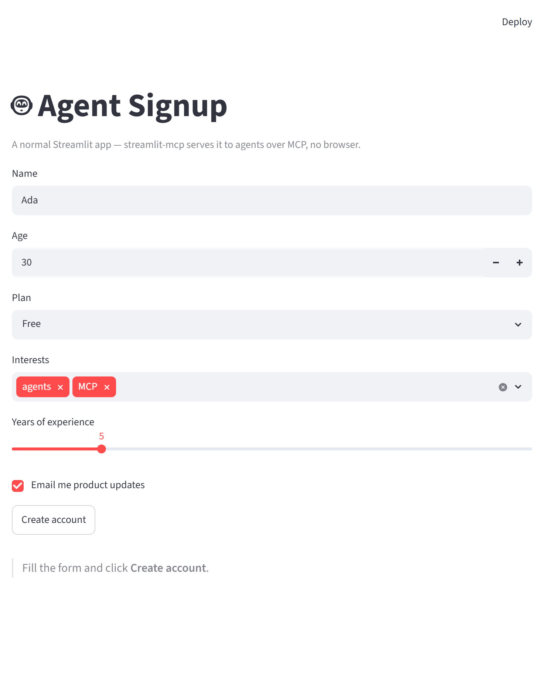
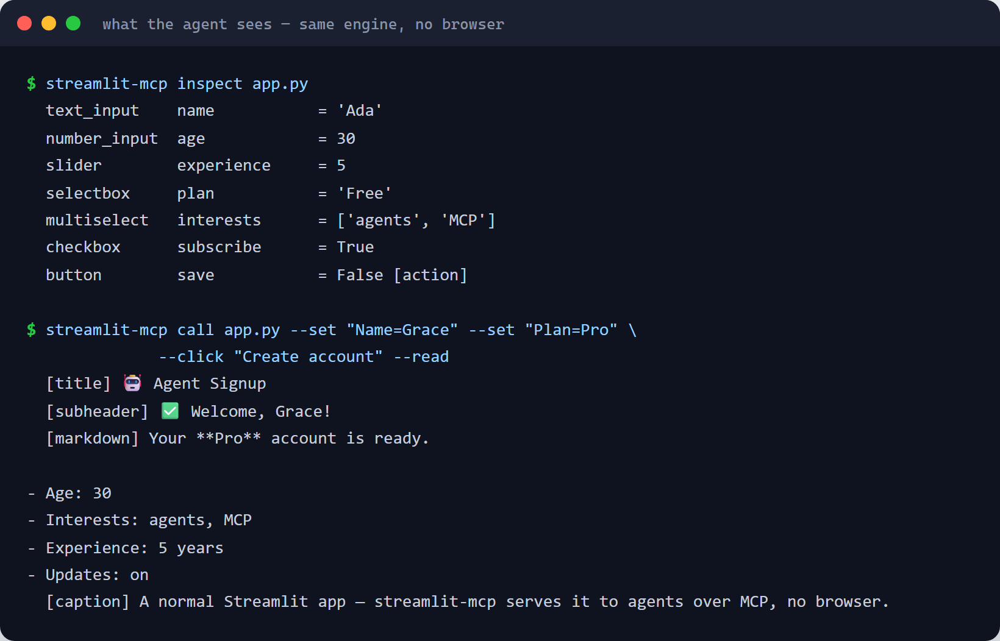

# streamlit-mcp

**Serve any Streamlit app as an MCP server.** Agents introspect your app's widgets,
set values, click buttons, and read the rendered output and `session_state` — natively,
over MCP, with **no browser automation**.

📖 **Documentation:** <https://dkedar7.github.io/streamlit-mcp/>

```bash
pip install streamlit-mcp          # or run with no install via: uvx streamlit-mcp ...

# serve an app over MCP (stdio for local clients)
streamlit-mcp serve app.py
# ...or HTTP/SSE on loopback for local networked agents
streamlit-mcp serve app.py --transport http --port 8000

# drive it yourself from the terminal (same engine the agent uses)
streamlit-mcp inspect app.py
streamlit-mcp call app.py --set "Name=agent" --click "Save" --read
```

Streamlit has no callback graph — it reruns the whole script per interaction — so
streamlit-mcp drives the app headlessly through Streamlit's own test runtime
(`streamlit.testing.v1.AppTest`) and returns the **semantic element tree**, not pixels.
Gradio and Dash already shipped native app-as-MCP; this fills the Streamlit gap.

## Demo

A normal Streamlit app (what a human opens in a browser) and what an agent does with the same
app over MCP — `inspect` the widgets, `call` to set values / click / read the result. No browser:

<table>
<tr>
<td width="50%"></td>
<td width="50%"></td>
</tr>
<tr>
<td align="center"><em>The app a human runs</em></td>
<td align="center"><em>What the agent sees over MCP</em></td>
</tr>
</table>

A human can also watch the agent work **live** in their browser — no refresh, no browser automation —
by opting in with one `with` block (`from streamlit_mcp.live import live`). See the
[live / human-in-the-loop guide](https://dkedar7.github.io/streamlit-mcp/live/).

## Use it with an MCP client

**Claude Desktop / Cursor** — add to your MCP config (`claude_desktop_config.json` or
`.cursor/mcp.json`):

```json
{
  "mcpServers": {
    "streamlit-mcp": {
      "command": "uvx",
      "args": ["streamlit-mcp", "serve", "/absolute/path/to/your/app.py"]
    }
  }
}
```

**Claude Code:**

```bash
claude mcp add streamlit-mcp -- uvx streamlit-mcp serve /absolute/path/to/your/app.py
```

`uvx` runs the published package with no prior install. stdio (the default) is the right
transport for local clients.

## Tools exposed to agents

| Tool | What it does |
|---|---|
| `list_widgets` / `get_layout` | introspect widgets (kind, label, value, constraints) |
| `set_widget(identifier, value)` | set a widget and rerun |
| `click(identifier)` | click a button and rerun |
| `read_output()` | the rendered element tree, agent-readable |
| `get_state()` | the app's `session_state` |

Supported widgets: text_input, number_input, text_area, slider, select_slider, selectbox,
multiselect, checkbox, toggle, radio, button, date_input, time_input, color_picker, pills,
segmented_control, feedback — including
their two-handle **range** forms (`st.slider("Price", 0, 100, (20, 80))`,
`st.date_input("Dates", (start, end))`), which advertise a 2-element array schema and take
`[low, high]`. An `st.form` is driven the way a human drives it: set the fields, then click the
form's submit button.

Input widgets streamlit-mcp can't drive (file_uploader, camera_input, audio_input, chat_input,
data_editor, …) are reported explicitly on every surface (text `--layout`,
`--json`, MCP `get_layout`), never silently dropped — wherever they're placed, including
`st.sidebar.file_uploader(...)` and inside columns, tabs and containers.

## Custom semantic tools

Beyond the per-widget tools, expose a higher-level named action by decorating a function with
`@mcp_tool` in your app file:

```python
import streamlit as st
from streamlit_mcp import mcp_tool

@mcp_tool
def reset_all():
    """Reset everything to defaults."""
    return {"ok": True}

st.text_input("Name")
```

`streamlit-mcp serve app.py` loads the app and exposes `reset_all` over MCP alongside the widget
tools. The decorated function is called directly (it isn't a widget), so keep it self-contained.
It's reachable from the CLI too (human ↔ agent parity): `streamlit-mcp inspect app.py` lists it and
`streamlit-mcp call app.py --tool reset_all` invokes it.

## Human ↔ agent parity

Everything an agent can do over MCP, a human can do via the CLI — both call the same
engine. The read-only mode and widget allow-list guardrails apply identically to both
surfaces. If the served app raises, the exception is reported on every surface — `--json`,
MCP `read_output`/`get_layout`, and the text CLI — and `call`/`inspect --strict` exit
non-zero on an app exception (for CI/scripts).

## Security / trust model

- **`app_path` is executed as trusted code** in the server process (that's how AppTest
  runs it). Only serve apps you trust.
- **`get_state` / `read_output` expose the app's `session_state`** to the caller — do not
  put secrets there.
- **HTTP/SSE bearer auth is enforced.** Pass `--bearer-token <T>` and every HTTP/SSE request
  must send `Authorization: Bearer <T>` — a missing or wrong token gets `401` before any tool
  runs. A non-loopback host is allowed **only** with a token set; without one, `serve` binds
  `127.0.0.1` only and refuses a non-loopback host (fail closed). stdio is local and
  unauthenticated.

## Known limitations

- **Sessions are not disposed.** Per-client isolation works, but there is no session-close
  hook, so a long-running HTTP server accumulates one runtime per client. stdio and
  single-client use are unaffected.
- **No concurrency locking.** Concurrent requests sharing one session are not serialized, and
  `AppTest` is not known to be re-entrant — use one in-flight request per session for now.
- **Output capture** covers headings / markdown / caption / text; `st.write`, `st.error`, and
  similar are a planned coverage expansion.

## License

MIT
