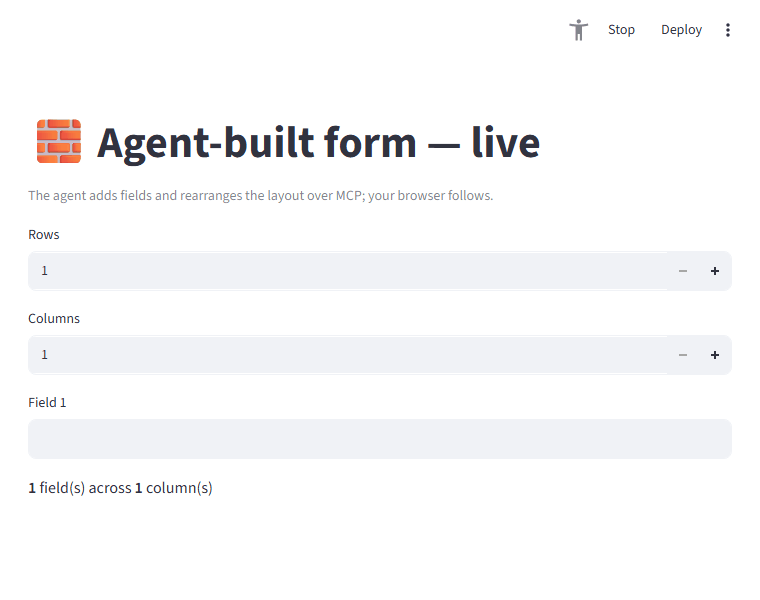

# Dynamic / agent-driven layout

The agent never edits your script and there's no DOM to manipulate — it drives Streamlit's
*semantic tree* with the same `set_widget`/`click` it always uses. But because Streamlit **reruns
the whole script on every interaction**, the rendered layout is a **function of state**. So when
the agent changes state the app branches on, the rerun produces a *different structure* — more or
fewer components, a different layout, reordered items. With [`live`](live.md), a human watches it
happen in their browser.



The agent set `Rows=4` and `Columns=2` over MCP; the form grew from one field to four, re-flowed
into two columns — no manual refresh, no browser automation.

## How: make structure a function of state

Render your components *from* state, and let the agent drive that state through widgets:

```python
import streamlit as st
from streamlit_mcp.live import live

# Sync only the *controlling* state (the structure), not each generated field.
with live("dynamic", defaults={"rows": 1, "cols": 1}):
    rows = int(st.number_input("Rows", min_value=1, max_value=6, key="rows"))
    cols = int(st.number_input("Columns", min_value=1, max_value=3, key="cols"))

    columns = st.columns(cols)
    for i in range(rows):
        with columns[i % cols]:
            st.text_input(f"Field {i + 1}", key=f"field_{i}")
```

`streamlit-mcp call examples/dynamic_app.py --set "Rows=4" --set "Columns=2" --read` makes the app
render four fields across two columns. The full example is
[`examples/dynamic_app.py`](https://github.com/dkedar7/streamlit-mcp/blob/main/examples/dynamic_app.py).

## What the agent can and can't do

| Want | Possible? | How |
|---|---|---|
| **Add components** | ✅ if the app supports it | Drive a "count" input or click an "add" button; the script renders the new widgets on rerun |
| **Show / hide sections** | ✅ | Toggle a checkbox/selectbox the app gates `st.expander`/`st.tabs`/`if` on |
| **Change layout** | ✅ | A control the app uses to choose `st.columns` vs stacked, column count, etc. |
| **Reorder components** | ✅ *only* if the app renders from an ordered state list (e.g. a "move up" button reordering a `session_state` list) |
| **Inject a component the script never defines** | ❌ | The agent can't author new `st.*` calls or edit code |
| **DOM / pixel rearrangement** | ❌ | There's no browser/DOM — it's the AppTest semantic tree |

The agent rearranges the app's **declared possibilities**, not arbitrary UI. This is the project's
agent-native principle: the author decides what's mutable by exposing it as widgets/actions.

!!! note "Structural changes must go through widgets"
    Drive structure with `set_widget`/`click` (which run *inside* the rerun, where `session_state`
    is real). `@mcp_tool` semantic tools are invoked **outside** a script run, so they can't mutate
    the live widget tree — use them for app-independent actions, not layout changes.

## Syncing to the browser

For the human's browser to follow, sync the **controlling** state (a count, a layout choice, a
list) via `live(...)`'s `defaults` and render the components from it — don't try to sync an
unbounded set of dynamically-keyed widgets. The dynamically generated fields above are local;
only `rows`/`cols` (the structure) are synced, which is what makes the layout re-flow live.
