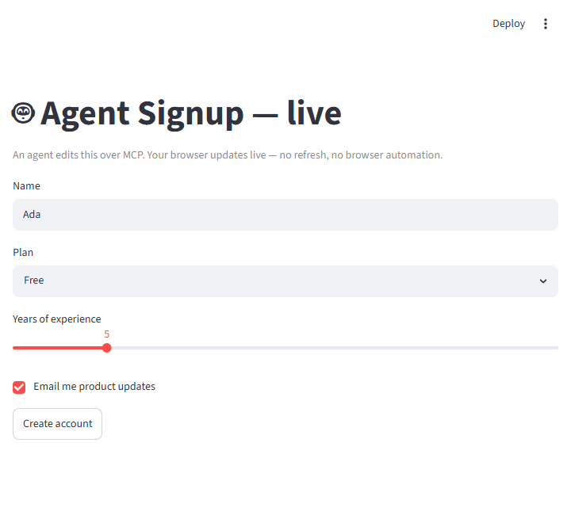

# Live / human-in-the-loop

streamlit-mcp drives apps **headlessly** — the agent gets the rendered element tree, and a human
watching `streamlit run` in a browser normally doesn't see those edits, because **Streamlit
sessions are isolated** (each connection has its own `session_state`). So "the human watches the
agent's edits appear live" isn't a connection trick — it needs **shared state the app re-reads**.

`streamlit_mcp.live` packages that in one `with` block. An agent edits over MCP from one process;
a browser updates live in another — no manual refresh, and no browser automation:



## Opt in with one `with` block

```python
import streamlit as st
from streamlit_mcp.live import live

with live("signup", defaults={"name": "Ada", "plan": "Free", "created": False}):
    st.text_input("Name", key="name")
    st.selectbox("Plan", ["Free", "Pro", "Team"], key="plan")
    if st.button("Create account"):
        st.session_state["created"] = True
    if st.session_state["created"]:
        st.subheader(f"Welcome, {st.session_state['name']}!")
```

- `defaults` declares the synced `session_state` keys and their initial values. Synced widgets
  use a matching `key=`.
- **Action buttons** aren't persistent widget state, so represent them as a `defaults` flag the app
  sets (e.g. `created`).
- Pass `run_every=` (default `"1s"`) to tune how often the browser polls, or `store=` to use a
  custom backend (see below).

## Run it

Point both at the same file (the `name` you pass to `live(...)` is what links them):

```bash
streamlit run examples/live_app.py            # the human's browser
streamlit-mcp serve examples/live_app.py      # the agent, over MCP

# ...or drive it directly and watch the browser update:
streamlit-mcp call examples/live_app.py --set "Name=Grace" --set "Plan=Pro" \
    --click "Create account" --read
```

The browser running `streamlit run` updates within `run_every` of the agent's edit. The full
example is [`examples/live_app.py`](https://github.com/dkedar7/streamlit-mcp/blob/main/examples/live_app.py).

## A custom store (multi-node)

The default is a local JSON file (one machine). For multiple servers, pass any object with
`load() -> (version, fields)` and `save(fields, version)`:

```python
from streamlit_mcp.live import live, Store  # Store is a typing Protocol

class RedisStore:           # sketch — wire up your own client
    def load(self): ...
    def save(self, fields, version): ...

with live("signup", defaults={...}, store=RedisStore()):
    ...
```

## Under the hood

`live(...)` is a small context manager around the existing tools — no new MCP surface:

1. **A versioned store is the source of truth.** On `__enter__`, it re-seeds the synced
   `session_state` keys from the store **before any widget is created** (the only point Streamlit
   lets you overwrite a widget's value), but only when the store changed externally.
2. **Edits publish a new version.** On `__exit__`, if a synced widget changed (the human typed, or
   the agent's `set_widget`/`click` reran the app), it writes the new values to the store with
   `version + 1`. The version is what prevents an echo loop.
3. **The browser polls and adopts.** In a live browser session it installs
   `st.fragment(run_every=...)` that re-reads the version and `st.rerun(scope="app")`s when it
   changed. (Under headless AppTest — the agent, or tests — the poll is skipped; there's no browser
   to refresh.)

## Caveats

- Synced values may be any JSON-native type plus `date` / `datetime` / `time` (so `date_input`
  and `time_input` work); other custom types need a custom `Store`.
- A **file store** is fine for one machine; use a shared `Store` (Redis/DB) across servers.
- It's **last-writer-wins** on a coarse version (atomic writes prevent torn reads, not lost
  concurrent updates) — fine for human-in-the-loop, not a CRDT.
- Polling reruns the script every `run_every` — tune it for your app.
- **The store persists across restarts** — it's the source of truth, so `defaults` only seed an
  *empty* store. A fresh browser shows the last values written, not `defaults`; to reset, delete
  the store file (`FileStore` lives at `<tempdir>/streamlit_mcp_live_<name>.json`) or change the
  `live()` name.
